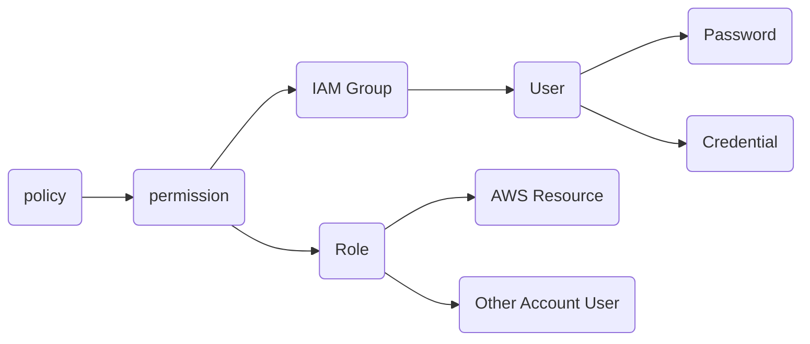

# webide-demo

# AWS IAM

```mermaid
graph LR
A(policy) --> B(permission) --> C(IAM Group)
C --> D(User)
D --> E(Password)
D --> F(Credential)
B --> G(Role)
G --> H(AWS Resource)
G --> I(Other Account User)
```

hihihihihihihihihih
